**Blockchain based secure IOT and Federated Learning**

**Team Members**

Aadharsh Aadhithya (CB.EN.U4AIE20001)

Akshaya Jeyaprakash(CB.EN.U4AIE20003)

Abinesh Sivakumar(CB.EN.U4AIE20002)

Jayanth M (CB.EN.U4AIE20024)

Vishnu Radhakrishnan (CB.EN.U4AIE20074)

..................................................................

18th June 2022.

**Introduction:**

the problem with current IoT solutions is its need for a centralized
party (like a cloud server), for connecting and communicating via the
Internet, which poses a great threat to the privacy and security of the
vast sensitive data being generated, whereas the

original architecture design demands for a decentralized one like
distributed or peer-to- peer (P2P) system. So, blockchain comes into
play, providing a secure and trustworthy way of sharing information
using a distributed/P2P model, to achieve transparency, security,
privacy, auditability, resilience, access authentication, data
immutability, etc

Blockchain and Internet of Things (IoT), two of the top disruptive
technologies, are already on their way of reshaping our future of the
digital world, characterized by a drastic change in the current network
architecture. Incorporation of IoT has brought the objects around us to
life, making them 'smart' and capable of communicating with each other,
thereby amassing massive data by constantly capturing the physical
world, for analyzing and performing some intelligent action based on the
same.

the problem with current IoT solutions is its need for a centralized
party (like a cloud server), for connecting and communicating via the
Internet, which poses a great threat to the privacy and security of the
vast sensitive data being generated, whereas the original architecture
design demands for a decentralized one like distributed or peer-to- peer
(P2P) system. So, blockchain comes into play, providing a secure and
trustworthy way of sharing information using a distributed/P2P model, to
achieve transparency, security, privacy, auditability, resilience,
access authentication, data immutability, etc.

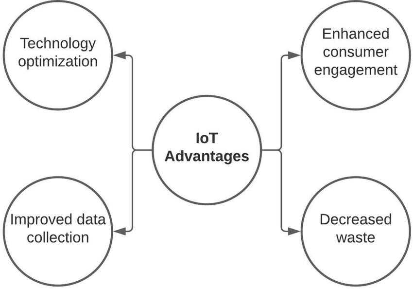{width="4.433333333333334in"
height="3.0930555555555554in"}

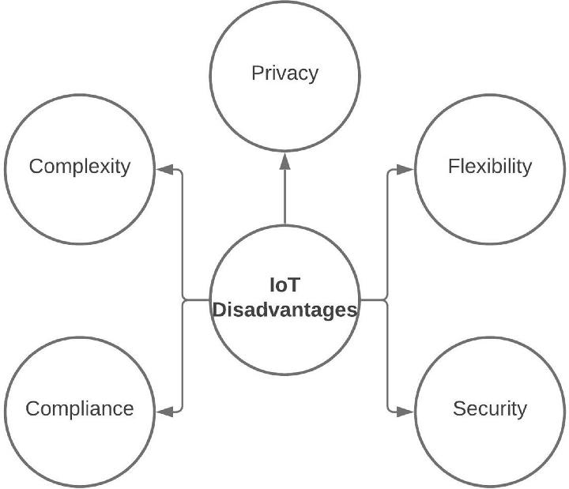{width="4.605555555555555in"
height="3.9638877952755904in"}

**Methodology :**

> 1.Getting Client data using MQTT protocol and Creating a private
> blockchain to
>
> protect client data using hashing algorithms
>
> 2\. TCP socket programming will be implemented on RPi boards in order
> to carry out the connection between 1 server and 2 clients. To do so,
> the parallel\
> computation for federated learning\
> 3.

**Strength of IoT** :

Due to the network of devices, a person can access data irrespective of
their location making it convenient for people to use. When
communications are not fluent and transparent, inefficiencies are
caused, but with a network of interconnected devices, better
communication is possible, as transferring data packets over connected
network save time and money\[5\]. IoT not only helps to save time and
money but achieve automation- the most important aspect in today's
tech-savvy life where all the tasks can be achieved without human
intervention, with increasing quality of services.

**Platform** :

IoT system utilizes hardware part (sensors) to collect information from
the environment and needs connectivity to transmit and receive data to
and from cloud/server. The software part in IoT helps in analyzing data
and make decisions, and a user interface helps users to interact with
system\[6\]. IoT platforms are the support software that connects
everything in an IoT system, facilitating communication, data flow,
device management, security, authentication and the functionality of
applications\[7\]. For efficient inter-process communication and
management of the network, various standardized protocols such as CoAP,
XMPP, MQTT are used.

**Problems in current IoT solutions :**

IoT is a decentralized network in which devices communicate with each
other to carry out the specific tasks. But current IoT solutions have a
centralized brokered\
communication framework, wherein all the data is stored at a central
data storage, like cloud servers, making it susceptible to Byzantine
failure. This makes it a critical\
bottleneck factor affecting the performance of the system, owing to the
large scale of devices in the network and increasing traffic which
introduces operational delays and redundant data transfers. Also, the
client-server model is very expensive in terms of high infrastructure
costs, low inter-operability due to restricted data aggregation and
heterogeneity of devices, coordination with other centralized IoT
frameworks,\
maintenance costs, networking equipment costs, etc. and cloud server
becomes a single point of failure, hence disrupting the entire network
and renders services useless in event of an attack

Using a decentralized architecture will alleviate if not eliminate all
such costs, such as the reduction in redundancy and amount of data
transfers, improvement of services, Byzantine fault resistant, better
protection against threats and attacks, privacy and secrecy of data,
autonomous operations, management and operational costs of servers.

But IoT applications deal with a huge amount of sensitive and personal
data and it requires a standardized P2P communication model, which is
able to provide validation of devices and authentication of data
generated by them in order to prevent mistrust and theft in the network

**Blockchain:**

Blockchain consists of two parts -- Blocks, which contains a set of
transactions and other records like hash values and Chain, which is a
cryptographic arrangement of blocks using hash values of previous
blocks. It is designed to overcome the need for a central arbitrator to
provide digital trust for coordinating transactions among entities , and
is robust to Byzantine Fault Tolerance, since everything recorded is
available to all nodes in the network, to verify and audit independently
and inexpensively , and also solves the double-spend problem. It leads
to the formation of an incorruptible shared digital ledger having the
capability of recording everything

**Working :**

The basis for building a blockchain is a P2P network comprising of all
the devices required to meet the goals of the application. Asymmetric
cryptography is employed, such that each of the nodes is assigned two
keys: Public key for identifying a device in the network and Private key
for signing the transactions to itself or other devices in the network
.Whenever a device wants to carry out a transaction, it signs using its
private key and sends it to its neighbors for verification, which
disseminates it further into the network. The private key serves for
authentication and integrity and once validated by the network, various
such transactions are packed into a timestamped block by miners. The
validation of block can be done by various methods, and then it is
broadcasted into the network, where all the nodes verify the block and
its transactions, and the hash linkage to the previous block. Once
verified, it is added to the chain and updated, otherwise discarded.

It must be asymmetric, that is difficult to find and compute, but easier
to verify. For validation, the basic prerequisite is that the majority
of the nodes in the network must be honest. One of the typically used
consensus algorithms is Proof of Work (PoW). In PoW, the miner must
solve a very computationally difficult problem- a very resource and
energy consuming task. Though it is criticized, it is what gives the
value to the performed work. The miner who first solves the puzzle
broadcasts the block into the network for validation and gets a reward
for the same, hence incentivizing the miners to stay honest.

**Federated Learning :**

Artificial Intelligence is a forever emerging and advancing technology.
Artificial intelligence models are used increasingly widely in today's
world. With the power of data and artificial intelligence, machines are
able to demonstrate human intelligence. Federated Learning is simply the
**decentralized** form of Machine Learning. Federated learning is a
relatively new type of learning that avoids centralized data collection
and model training.

In a traditional machine learning pipeline, data is collected from
different sources (e.g.

mobile devices) and stored in a central location (i.e. data center).
Once all data is available at a center, a single machine learning model
is trained by such data. Because the data must be moved from the users'
devices to a central device for building and training the model, this
approach is called **centralized learning**.

On the other hand, federated learning is about training multiple machine
learning models on mobile devices (which are referred to as clients) and
then combining the results of all such models into a single model that
resides at a server. Thus, a model is trained on devices themselves
using ground-truth data and just the trained model is shared with a
server. This way the user's data is leveraged to build machine/deep
learning models while keeping data private. In this case, federated
learning benefits from the users' data without revealing their privacy.
The raw data is available at the users' devices and never moved to a
data center---but a model out of this data is created, which in turn is
sent to the server. Using federated learning, the user's data is not
uploaded to the server and thus there is no DIRECT access to the data

**Steps for Federated Learning**

> 1.A generic (shared) model is trained server-side.
>
> 2.A number of clients are selected for training on top of the generic
> model. 3.The selected clients download the model.
>
> 4.The generic model is trained on the devices, leveraging the users'
> private data, based on an optimization algorithm like the stochastic
> gradient descent.
>
> 5.A summary of the changes made to the model (i.e. weights of the
> trained neural network) is sent to the server.
>
> 6.The server aggregates the updates from all devices to improve the
> shared model. Update aggregation is done using a new algorithm called
> the **federated averaging algorithm**.
>
> 7.The process of sending the generic model to mobile devices and
> updating them according to the received summary of updates is
> repeated.

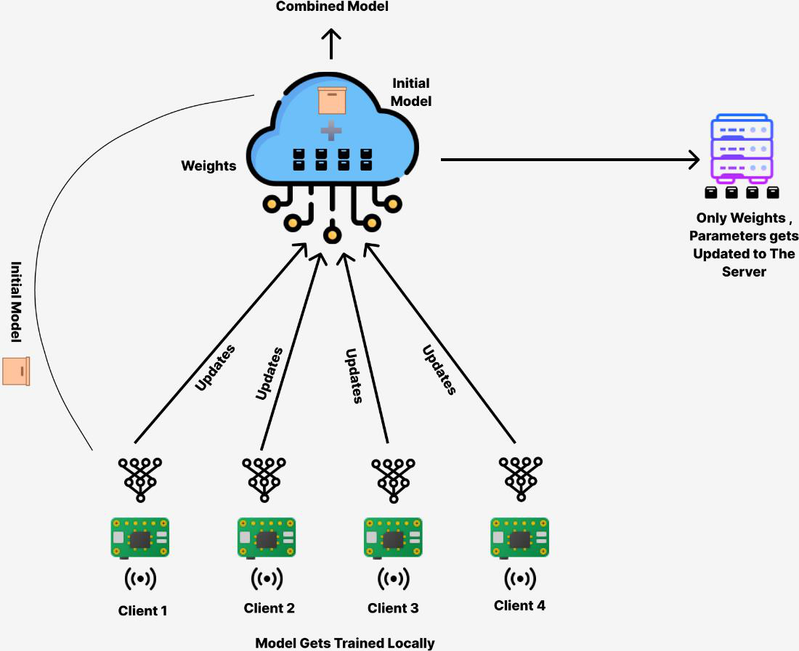{width="5.0in"
height="4.073611111111111in"}

**Properties of Problems Solved using Federated Learning :**

> 1.*Training on real-world data from mobile devices provides a
> distinct*\
> *advantage over training on proxy data that's generally available in
> the data center.*

When a single machine learning model is created at the server, it uses
data

from different users to create a single generic model. Because the users
vary

in how they use mobile devices, the model should be generic enough to
cope

with such variety. the user experience will not be enhanced by a generic

model, but instead by a customized model that seems created specifically
for

the device. Such personalization is achieved using federated learning
and can

provide the feeling that the device is created just for the user.

> *2.data is privacy sensitive or large in size (compared to the size of
> the model), so it is preferable not to log it to the data center
> purely for the purpose of model training*

It isn't practical for the ask the user to upload large amounts of data
to

create a generic model at the server. This adds additional costs to the

user. Also, the user is likely to reject uploading private data to help
build a

model, especially with applications that require sensitive user
information.

In cases where data is private or large in scale, federated learning is
a

good option compared to centralized learning.

*3.For supervised tasks, labels on the data can be inferred naturally
from*

> *user interaction*

In supervised learning, a model is trained using labeled data so that
the

model knows the labels of all training samples. For federated learning
to

work with supervised learning, the labels of the user's private data
must

be available.

**Federated Averaging Algorithm :**

At the server, K clients are selected, which are indexed by the variable
k. In

parallel, all clients update the generic model weights according to the

ClientUpdate() function, which returns the trained weights w back to the

server. Finally, the server takes the average of all weights w received
from

the K clients. The average of the weights is regarded as the new set of

weights for the generic model.

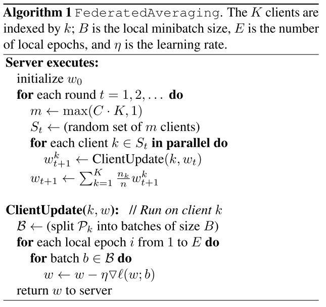{width="5.0in"
height="4.719444444444444in"}

**Raspberry-Pi Boards :**

Entering the era of IoT, the use of small, cheap and flexible computer

hardware that allow end-user programming become present. Raspberry-Pi is

one of them which remains an inexpensive, fully customizable, and

programmable small computer board with its very successfully usage in

diverse range of research applications in IoT. The RPi processor is a
32-bit,

700 MHz-1000 MHz Chip system based on ARM11 and overclocked to

provide extra power. The Raspberry Pi Processor's SD Flash Memory

functions as a hard drive. It comes with the micro USB connector and can
be

operated via an Ethernet/LAN cable or a USB dongle

**FedAvg in Raspberry Pi :**\
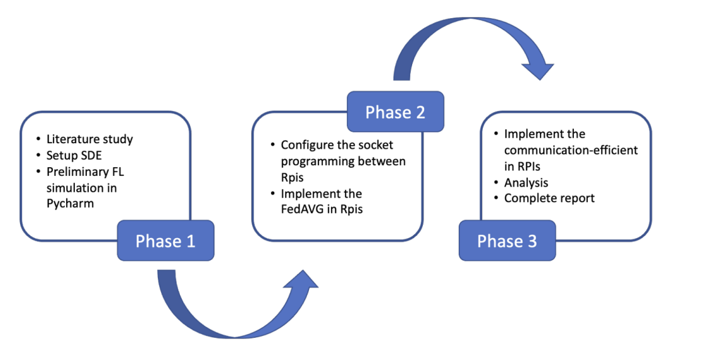{width="5.0in"
height="2.4472222222222224in"}

The socket library consists of methods to create the socket, bind the
socket to an IP address and port number, listening and accepting the
connections, close the\
connection, and finally close the socket. Since the implementation only
requires 2 clients and 1 server, the TCP socket programming is feasible
to be applied in the project. Moreover, this application can be extended
with thread feature for opening connections with multiple clients at the
same time. thread is light-weight process that does not require much
memory overhead. While for ending/receiving data between RPi boards, we
used pickle method. Since the data is in byte form, it must be decoded
in order to be retrieved.

Throughout this project, an object representing the FL model will be
transmitted over the socket, so an object encoding/decoding process is
needed. Therefore, the pickle library exists for this purpose. pickle
can operate with any data since everything in Python is an object.

**Implementation of Blockchain and Federated Learning:**

we shall see about how the concept of blockchain is amalgamated with a
simple smarthome application using Raspberry-pi's. Let us consider a
simple Smart home network as in the following figure.

> 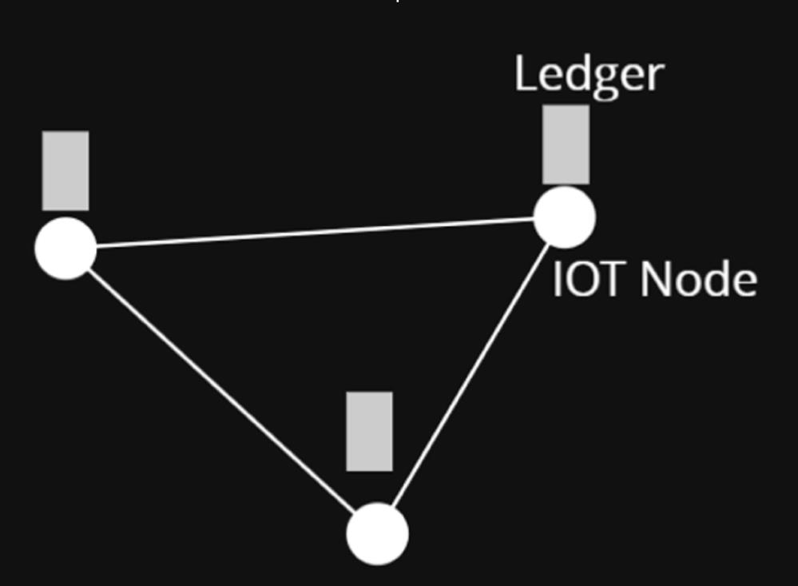{width="5.0in"
> height="3.6666666666666665in"}

Here, each circle represents an IoT node, here we have used raspberry-pi
as an IoT node. Each rectangle represents an Instance of a hyper-ledger
(Blockchain). Here, in the case of smart home, the state of the network
is set using various observable parameters (such as temperature,
humidity, the wetness in soil, if door is open or closed, etc.) which
are collected using wide-range of sensor (such as the temperature
sensor, motion sensor, water detection sensor, etc.). This state data is
collected and stored in a blockchain so as to ensure that it is
immutable and is stored in a decentralized manner. The mutability of
this data decreases accuracy of the model. If the data is altered by an
unknown person, the model might not be trained as per the requirement of
the user.

There are a few disadvantages of using this scheme, which are stated as
follows,

> 1.Time series data is voluminous and will not be viable to have
> multiple copies across
>
> all devices\
> 2.Data is present all over the network. Not secure over a public
> network. 3.Proof of work is computationally demanding.

The only solution to avoid these disadvantages is to Store data locally,
send only what is required to the central node and Use proper Encryption
based Schemes or to involve multiple types of nodes among which a few
shall be exclusively used for data collection few exclusively for
dealing with blockchain architecture.

In order to get a better understanding of how Proof of Work works for
federated learning, let us consider an example of plant monitoring and
water irrigation application. Under that let us consider two cases:

Case-1: A plant present in extreme climatic conditions. The person
taking care of this plant waters it if the surrounding temperature is
more that 26o Celsius and humidity is less than 44.

Case-2: A plant present in moderate or average climatic conditions. The
person taking care of this plant waters it if the surrounding
temperature is more that 25o Celsius and humidity is less than 50.

{width="6.5in"
height="3.0833333333333335in"}On plotting the distribution of this data,
we will get two plots as shown below. In this the first plot represents
the plant as in case-1 where the yellow colored dots represent that the
plant will be irrigated at that particular climatic conditions. The
second plot represents the similar data points for case-1 plant.

{width="6.5in"
height="2.1041666666666665in"}

From these plots we can observe that the data is non-identically
distributed. So, two different machine learning models are created and
these two sets of data-points are trained to them separately, followed
by which the sigmoid function graph of both the models are generated and
plotted, which can be seen in the following figure. These two models are
then sent to the server and aggregated for updating the average model.

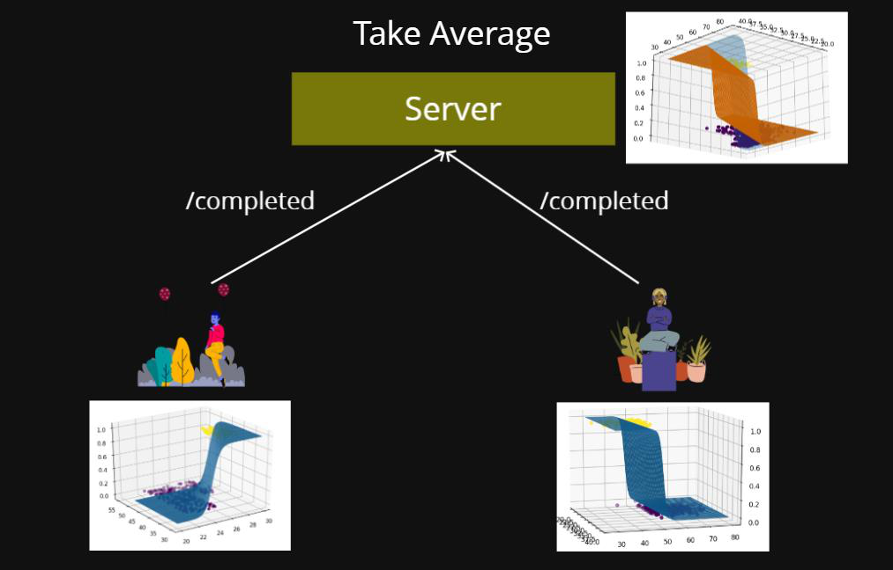{width="4.311110017497813in"
height="2.7708333333333335in"}

**Implementation Of Federated Learning using Socket Programming:**

> •Apply the concepts of Federated Learning In Python .
>
> •Using Socket Programing for communication between Clients and
>
> Server.
>
> •The ML model is created using PyGAD which trains ML models
>
> using the genetic algorithm (GA)

Client Server Connection

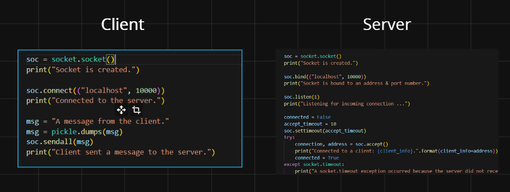{width="5.0in"
height="1.8861100174978127in"}

XOR Problem

The XOr problem is that we need to build a Neural Network to produce the
truth table related to the XOr logical operator. This is a binary
classification problem. Supervised learning is a better way to solve it.

> 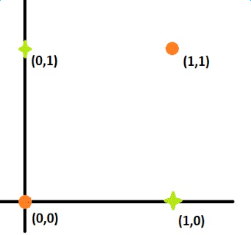{width="2.613888888888889in"
> height="2.4472222222222224in"}\
> Non-Linearly Separable Data Points

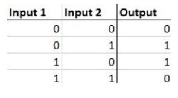{width="3.0722222222222224in"
height="1.698611111111111in"}

XOR Function

Client- server

+---+-----------------------------------------------------------------+
| • | > server.py: The server app. It creates a model that is trained |
|   | > on the clients\' devices using                                |
+===+=================================================================+
| • | > FL.                                                           |
+---+-----------------------------------------------------------------+
|   | client1.py: A client app which trains the model sent by the     |
|   | server using just 2 samples                                     |
+---+-----------------------------------------------------------------+
| • | > of the XOR problem.                                           |
+---+-----------------------------------------------------------------+
|   | client2.py: Another client app that trains the server\'s model  |
|   | using the other 2 samples                                       |
+---+-----------------------------------------------------------------+
|   | > in the XOR problem.                                           |
+---+-----------------------------------------------------------------+

Output

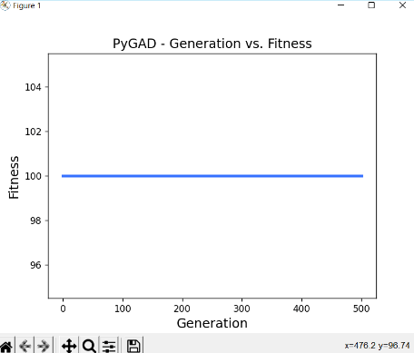{width="4.75in"
height="4.052777777777778in"}

Client-1 running

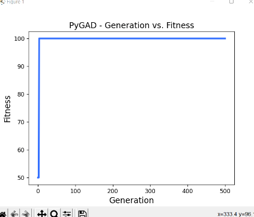{width="4.405555555555556in"
height="3.7708333333333335in"}

Initiating Client

**Networking Concepts Used:**

> 1.Configuring a local subnet (2 rpi 1 server) 2.Blockchain using
> networking\
> 3.smart home using iot\
> 4.Client and server with Socket programming
